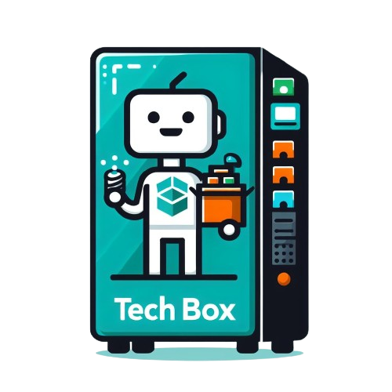

<h1 align="center" id="title">TechBox - Web</h1>

  

TechBox is a project that is composed by a website, mobile app and a prototype of a vending machine to do loans of material by an automatic way without intermediaries. The website is the part of the project which is directed to the person in charge of the material or who will be monitoring the loans.

<h2>🚀 Demo</h2>

<a href="https://tech-box-5j1w.vercel.app/">Click here to see the Demo</a>

  
  
<h2>🧐 Characteristics</h2>

*   Demostrative webstie
*   Admin panel
*   CRUD of inventories and users
*   Loan history
*   Statistics realated to users and loans

  
  
<h2>💻 Made with</h2>

*   React + Vite
*   Tailwind CSS
*   JavaScript
*   Firebase Real Time Database and Authenticator

<h2>💖 Did you like the project?</h2>

 Know the creators:

<a href="https://github.com/julioerives">Julio Erives<a>
 

<a href="https://github.com/aahpichardo">Angel Hernandez<a>

<a href="https://github.com/Hgdv11">Hugo Chaparro<a>

<a href="https://github.com/SantiagerArmendariz">Santiago Armendariz<a>

<a href="https://github.com/Hgdv11/TechBox" target="_blank">Click here to see the Mobile App repository</a>

<a href="https://github.com/aahpichardo/techbox-microcontrolador" target="_blank">Click here to see the IoT repository</a>
